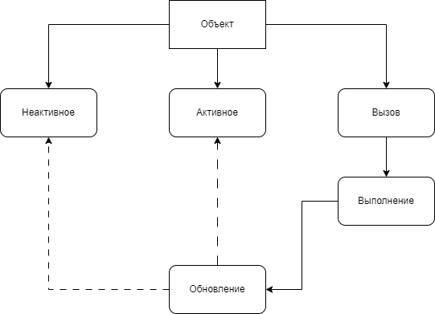
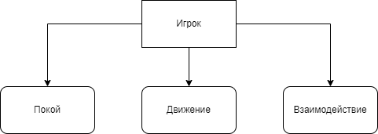
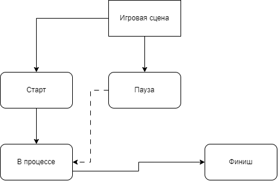
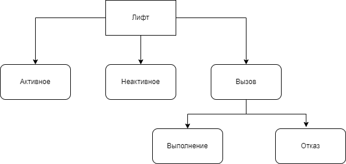

**C.O.U.T.C.R** - Control of Objects of Unknown Type and Conditional Reality

**Версия**: 0.1.0
# Концепт

Вы — сотрудник К.О.Н.Т.У.Р'а, который должен проводить анализ объектов на предполагаемое заражение спорами О-41 под прикрытием участкового полицейского. Вас отправили в старую хрущевку с подозрением на биологическое заражение. У вас есть **ограниченное время**, чтобы обойти 3 этажа, опросить жильцов и заполнить **Акт обследования**.  
# Жанр

- Тип: **2D Side-Scrolling**
- Стиль: pixe art (бесплатные ассеты или арт на коленки)
# Управление

Взаимодействие с окружением - E
Выбор первого инструмента - 1
Выбор второго инструмента - 2
Выбор третьего инструмента - 3
Движение вперед - D/Стрелка вправо
Движение назад - A/Стрелка влево
Открытие/закрытие журнала - J
# Механики

## Взаимодействие с окружением

- Игрок может взаимодействовать с окружением сцены
- Игрок может постучать в квартиру и получить три исхода:
	- Ему ответит жилец и сообщит подсказку о том, что не так в доме (случайная фраза, которая может быть подсказкой)
	- Ответа не последует
- Игрок может использовать лестницу, чтобы перейти на этаж выше
- Помимо лестницы. игрок может воспользоваться лифтом, который может его переместить ТОЛЬКО с 3-его этажа на первый
- В определенных местах сцены игрок может использовать предмет из своего инвентаря, чтобы собрать информацию, анализы или пометить место
## Взаимодействие с инвентарем

- Игроку перед заданием выдается три предмета для работы на объекте:
	- Одноразовые, 
	- С ограниченным количеством зарядов
	- Многоразовые, с перезарядкой
- Предмет выбирается и используется по нажатию цифр 1, 2, 3
## Взаимодействие с журналом

- С журналом можно взаимодействовать во время расследования
- В журнале есть краткое описание всех аномалий, характерных черт и возможных угроз
- Игрок может досрочно завершить расследование, отметив в журнале все необходимые пункты и покинуть объект
- После истечения таймера игрок должен отметить в журнале все, что он успел расследовать
---
# Описание игрового цикла

1. Игрок общается с жильцами, получая информацию, где ему искать примерное расположение источника заражения
2. Использует инвентарь для оценки заражения
3. Собирает информацию по аномалиям и возможным угрозам
4. Отмечает всю собранную информацию в журнале и завершает игру
5. Есть все отмечено верно, игрок получает очки для улучшения, иначе - становится испытуемым на объекте по исследованию аномалий (все накопленные улучшения сбрасываются)
## Критерии для победы

1. Отметить этаж, на котором выявлено заражение
2. Отметить квартиру или участок этажа откуда идет заражение
3. Отметить наличие аномалии на объекте
4. Отметить локацию аномалии при ее присутствии
5. Собрать улики для определения одного из монстров
# Локации

Для MVP реализовать нужно будет локацию трехэтажного дома с 6 квартирами (возможно добавление подвала, можно достичь только по лестнице).

---
# Монстры

## Перекожник

Существа-ловушки, которые прикидываются обитателями исходной локации. Не двигаются и обычно стоят спиной.
### Доказательства

- Вода: красный уровень заражения
- Споры: красный уровень заражения
- Наличие аномалии: да
## Мимик

Примитивные копии людей, находящиеся на Объектах и совершающие простые действия, не понимая зачем.
### Доказательства

- Вода: зеленый уровень заражения
- Споры: желтый уровень заражения
- Наличие аномалии: нет
## Симулякр

Нечто среднее между человеком, животным и предметом. Грибок может скрестить два живых организма или объединить живое и неживое, создавая странные и непредсказуемые формы.
### Доказательства

- Вода: красный уровень заражения
- Споры: желтый уровень заражения
- Наличие аномалии: да
## Заразитель

Зараженные люди.

Когда в организме накапливается критическое количество спор, начинается **споровый синдром**: личность постепенно разрушается, человек теряет своё «я», тело мутирует, растут сила и выносливость. С этого момента он сам становится переносчиком и заражает новый бетон.
### Доказательства

- Вода: желтый уровень заражения
- Споры: красный уровень заражения
- Наличие аномалии: нет

---
# Расходники (Предметы)

## Детектор спор (споровый детектор)

Небольшое устройство, которое позволяет зафиксировать частички спор в атмосфере.

**Количество улучшений**: 2
### УСМ-04 (1 уровень)

УСМ-04 (уловитель споровых масс, версия 4) - это устройство с тремя разноцветными лампами, которые отражают степень заражения области. Внутри устройства есть тканевый фильтр с активным реагентом для определения спор в атмосфере, светодатчик, насос.

**Расходуемый**: Да
**Количество зарядов**: 5
**Перезарядка**: 5 сек
**Время работы**: 1 сек

**Особенность работы**

При активации устройства, начинается активное всасывание ближайшего воздуха (в радиусе до 1м) и пропускание его через тканевый фильтр с активным веществом. Если споры есть в забранном воздухе, то активное вещество окрашивается в черный. Чем больше спор, тем сильнее фильтр окрашивается. После всасывания и окрашивания фильтра, светодатчик фиксирует пропускаемый свет и передает сигнал на одну из ламп.

После использования необходимо заменить фильтр, что занимает не более 5 сек. (В контексте игры - повторно использовать предмет).

Не самый надежный, так как фильтр может загрязниться от крупных частичек мусора в атмосфере и выдать ложный результат.

**Сигналы**:

- *Зеленый* - слабое заражение, в допустимых пределах, или его неактивная фаза
- *Желтый* - активная фаза заражения, контролируемая, может быть рядом с очагом заражения или стать им через некоторое время
- *Красный* - сигнализирует об нахождении в очаге заражения или непосредственной близости к нему (менее 3 м)
### ОкАС-02 (2 уровень)

ОкАС-02 (определитель количества активных спор, версия 2) - это устройство со шкалой количества активных спор в атмосфере. Устройство состоит из 3 колб с биологически активными компонентами, добавленные в не инертные газы, через которые пропускаются пробы воздуха.

**Расходуемый**: Да
**Количество зарядов**: 8
**Перезарядка**: 10 сек
**Время работы**: 0.5 сек

**Шкала заражения**:

- 0-99 - отсутствие заражения
- 100-299 - слабое заражение, в допустимых пределах
- 300-599 - активная фаза заражения, контролируемая, может быть рядом с очагом заражения или стать им через некоторое время
- > 600 - сигнализирует об нахождении в очаге заражения или непосредственной близости к нему (менее 1 м)

**Особенности работы**:

Устройство также всасывает воздух и пропускает его через специальные колбы с не инертными газами, которые вступают в химическую реакцию со спорами и выделяют тепло. Чем больше тепла выделяется, тем больше спор в атмосфере.

Данное устройство куда надежнее предшественника и обладает лишь одним недостатком - временем на охлаждение.
## Анализатор воды

Позволяет проверить пробы воды на наличие в них спор 0-41. 

**Количество улучшений**: 2
### Бумажный индикатор (1 уровень)

Обычный бумажный индикатор с цветовыми шкалами, который идет в комплекте с колбой для забора водных проб.

**Расходуемый**: Да
**Количество зарядов**: 3
**Перезарядка**: 0 сек
**Время работы**: 3 сек

**Индикация**:

- *Зеленый* - слабое заражение, в допустимых пределах
- *Желтый* - предельно допустимое заражение воды, пригодно к использованию после обработки. Есть риск перехода в "черную воду"
- *Красный* - выше предельно допустимого уровня заражения, не пригодно к использованию, начальная фаза перехода к "черной воде"

**Особенности работы**

Образец воды переливается в колбу (или сразу набирается в нее). После набора воды бумажный индикатор помещается в воду и через короткий промежуток времени вынимается. В зависимости от заражение бумажный индикатор примет соответствующий цвет.
### Электронно-химический анализатор ЭХА-25 (2 уровень)

ЭХА-25 - это удобный и быстрый способ определить содержание спор в пробах воды. Состоит из колбы для забора проб, аналогового дисплея с числовой индикацией количества спор на один кубосантиметр воды. Работает от пальчиковых батареек.

**Расходуемый**: Нет
**Количество зарядов**: 0
**Перезарядка**: 15 сек
**Время работы**: 1.5 сек

**Индикация**:

- 0-1 - отсутствие заражения
- 2-4 - слабое заражение, в допустимых пределах
- 5-7 - активная фаза заражения, контролируемая, может быть рядом с очагом заражения или стать им через некоторое время
- > 8 - сигнализирует об нахождении в очаге заражения или непосредственной близости к нему (менее 1 м)

**Особенности работы**

Образец воды переливается в колбу (или сразу набирается в нее) сбоку прибора. После закупоривания колбы идет анализ химического состава воды и вывод на дисплей прибора количества спор на 1 кубосантиметр воды. Является более точным прибором для определения заражения.
# Выявитель аномального состояния

## САП-13 (1 уровень)

САП-13 (считыватель аномальных помех, версия 13) - это устройство с двумя магнитными рамами и дисплеем между ними. Работает от батареек. 

**Расходуемый**: Да
**Количество зарядов**: 1
**Перезарядка**: 0 сек
**Время работы**: 0 сек

**Индикация**: При выявлении аномального поля, издает писк и выводит сообщение (АНОМ) на экран дисплея

**Особенности работы**

Данное устройство включено по умолчанию и срабатывает в непосредственной близости к аномалии, после срабатывания устройство непригодно к использованию без замены батарейки. Не указывает тип аномалии, кратковременно не прерывает ее действие
## ОАТп-2 (2 уровень)

ОАСп-2 (определитель-прерыватель аномальных состояний, версия 2) - это устройство с магнитной закругленной рамой и широким дисплеем. Работает от портативного аккумулятора.

**Расходуемый**: Да
**Количество зарядов**: 1
**Перезарядка**: 0 сек
**Время работы**: 30-90 сек

**Индикация**: При выявлении аномального поля, выводит на экран кодовые обозначения аномалий.

**Особенности работы**

Данное устройство включено по умолчанию и срабатывает в непосредственной близости к аномалии, после срабатывания устройство выводит на дисплее три наиболее подходящие по критериям оценки аномалии с числовой индикацией вероятной аномалии. Чем дольше находится вблизи аномалии, тем точнее будет оценка типа аномалии и ее числовой вероятностный показатель будет расти. 

Если использовать устройство вблизи аномалии, оно прервет аномалию и устранит ее с объекта на короткое время. Если пользователь устройства оказался непосредственно в аномалии, то при использовании прибора, оно не прерывает действие аномалии. После использования аккумулятор полностью разряжается. 
# Системы и состояния

## Системы

### Установка параметров объектов типа "Дверь"

Во время запуска игровой сцены задается ряд уникальных параметров:

- Активно/неактивно (Отражает сможет ли игрок взаимодействовать с объектом)
- Наличие реплик-подсказок или же их отсутствие (Объект может предоставлять как конкретную подсказку, так и просто реплику-филлер для отвлечения игрока)
- Нахождение вблизи или на отдалении от очага заражения (Если объект близко к очагу заражения у него обязательно будет реплика-подсказка или иное)
- Является ли очагом заражения (Может быть очагом заражения)

### Расстановка объектов типа "Заражение"

- Установка маркеров взаимодействия (Маркер не видит игрок, но при нахождении рядом  с ним и использовании определенного предмета может получить подсказку)
- Установка таймера на события-подсказки, либо активацию объекта (Ряд объектов могут быть не активны в первые минуты игры, но после определенного таймера могут дать подсказку игроку)
### Установка объекта  типа "Аномалия"

> Опциональный объект, может отсутствовать в игровой сцене

- Установка маркера взаимодействия (Маркер не виден игроку, влияет на определенный тип предмета у игрока)
- Установка таймера влияния на предмет игрока (При завершении таймера и взаимодействия с игроком, вызывает сигнал для его предмета, если тот в состоянии "Активное")
- Установка таймера влияние на игрока (При завершении таймера и взаимодействие с игроком, выбивает игрока из игровой сессии и завершает ее с провалом. Может быть предотвращено рядом объектов инвентаря игрока)

## Состояния

### Объекты инвентаря

Объект инвентаря имеет два ключевых состояния и дополнительно два под состояния.

1. **Неактивное** - состояние отражает невозможность использование, наступающее после использования предмета.
2. **Активное** - состояния по  умолчанию, отражает доступность предмета для использования. Данное состояние напрямую вызывает следующие состояния:
3. **Вызов** - состояния, когда предмет используется игроком или игровой сценой, после данного состояния вызывается состояние "Выполнение"
4. **Выполнение** - состояния выполнения действия объекта за определенный промежуток времени. Всегда после себя вызывает состояние "Обновление"
5. **Обновление** - состояние, которое идет после **Выполнения** и предшествует состояниям **Неактивное**/**Активное**
### Персонаж

Игрок обладает тремя состояниями:

1. **Покой** (Idle) - состояние характеризуется бездействием игрока
2. **Движение** (Move) - состояние характеризуется перемещением модели игрока по игровой сцене
3. **Взаимодействие** (Interact) - состояние взаимодействие с объектами игровой сцены (двери, лифт и т.д.) или использование объектов инвентаря

### Игровая сцена

1. **Старт** - состояние, когда игрок запускает игровую сцену, на данном этапе формируются все настройки игры от установки победного состояния до определение подсказок и расстановки объектов взаимодействия
2. **В процессе** - состояние, которое идет после полного запуска сцены и передачи управления игроку. Данное состояние напрямую влияет на состояние Финиш
3. **Финиш** - состояние, когда истек таймер или игрок преждевременно завершает его игровую сессию
4. **Пауза** - состояние, при котором таймер, игрок и все объекты с таймером останавливаются. Вызывается через открытие журнала

### Лифт

1. **Активное** - состояние доступности лифта для глобального взаимодействия и перехода к состоянию "Вызов"
2. **Неактивное** - состояние недоступности лифта для глобального взаимодействия и перехода к состоянию "Вызов"
3. **Вызов** - состояние, когда игрок взаимодействует с лифтом
4. **Выполнение** - состояние, когда игрок вызвал состояние "Вызов" и находится на допустимой области
5. **Отказ** -  состояние, когда игрок вызвал состояние "Вызов" и не находится на допустимой области

# План реализации проекта для Jam 

-  Карта/перемещение: 3 этажа, лестница между этажами, лифт 3→1, коллизии простые, камеры фиксированные.
-  Журнал: страница с чекбоксами/полями “этаж”, “квартира”, “улики”. Кнопка “завершить”.
-  Инструменты: детектор спор, индикатор воды и считыватель аномального состояния. Все для первого тира
-  События подсказок: 6 квартир, у 1-2 подсказки релевантные, у остальных нейтральные/шум. 
-  Состояния и таймер: пауза через журнал, финал по таймеру или досрочно.
-  Подсчёт результата: “правильная ячейка” + минимум улик = win, иначе fail/экзамен.
-  Полировка: одна простая анимация/звук на использование инструментов, и быстрый итерационный тест.

